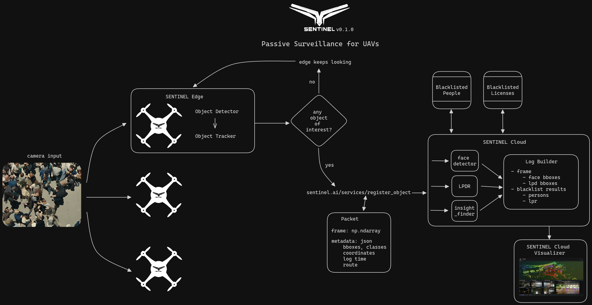

<p align="center">
  
</p>

# SENTINEL
AI-powered Drone Surveillance for Autonomous Search and Rescue, Law Enforcement and Defense. SENTINEL is a project developing a comprehensive drone-based system for aerial surveillance applications.

SENTINEL is based on a two-tier architecture:

- SENTINEL Cloud: Acts as the central hub, providing advanced AI functionalities for object detection, analysis, and event management. It also serves as the control center for raising alerts and coordinating responses.
- SENTINEL Edge: Deployed on individual drones (Sentinels), equipped with high-performance object detection models for real-time analysis at the edge. SENTINEL Edge communicates with the SENTINEL Cloud via secure RESTful APIs.

## sentinel-cloud
SENTINEL Cloud is the server-side of SENTINEL, focused on performing heavier operations that can't be done on SENTINEL Edge. The functionalities of SENTINEL Cloud can be accessed via RESTful APIs, this is the control central for accesing advanced AI features, as well as raising alerts in the central system.

SENTINEL Cloud includes extended AI functionalities such as:
- Face detection
- Face recognition
- License plate detection and recognition
- Crowd counting

SENTINEL Cloud is also the control central to raise events and alerts such as:
- Anomaly detection
- Blacklisted person alert
- Blacklisted license plate alert


## Passive Surveillance architecture
<p align="center">
  
</p>

The most basic task of SENTINEL is the **Passive Surveillance**, which basically consists on giving the UAVs the ability to run an object detector and tracker, and report any find of a target object via the ```register_object``` API. The basic flow looks like this:

1. The UAVs running SENTINEL Edge will be monitoring (based on a mission plan, route, or manual control) everything in their cameras.
2. If SENTINEl Edge detects any object of interest (person, car), a Packet will be sent to SENTINEL Cloud via the ```register_object``` API. The packet will include the complete frame, as well as the event metadata: event time, bounding boxes, classes, coordinates, Sentinel ID (unique identifier for the UAV).
3. SENTINEL Cloud will be constantly listening for objects, once an event is registered, the cloud will detect faces and license plates, if there are findings, both the faces and the license plates will be compared against any register in the blacklist databases.
4. A log builder that lives in SENTINEL Cloud will create a log entry for the Visualizer, which is a web-based tool for visualizing multimodal data over time.

## SENTINEL Tasks
There are two main tasks that SENTINEL aims to bring to UAVs:

- **Passive Surveillance** (WIP): Focused on increasing UAVs capabilities by the usage of artificial intelligence models, both on the device and with advanced services on the cloud. The passive surveillance task is an add-on to the existing technologies of UAV-based monitoring, such as mission planners and human-controlled missions. Useful when the user already have UAV pilots or well-designed surveillance missions, SENTINEL Passive Surveillance brings advanced analytics to video-capable UAVs.
- **Active Surveillance** (Future): The next step for UAVs' autonomy, built on top of SENTINEL Passive Suveillance functionalities, SENTINEL Active Surveillance brings automated control and intelligent mission plans. While Passive Surveillance depended on a pilot or a pre-defined mission, Active Surveillance allows SENTINEL to control the UAVs to improve routes based on AI.