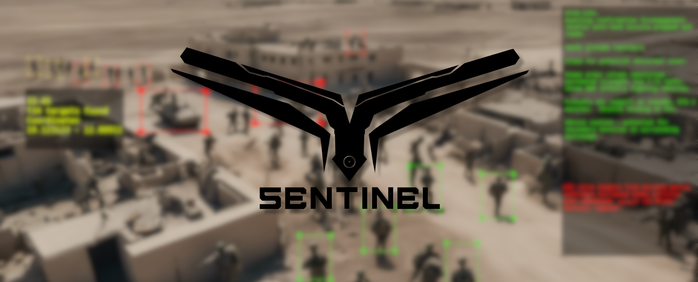

  

# SENTINEL
AI-powered Drone Surveillance for Autonomous Search and Rescue, Law Enforcement and Defense. SENTINEL is a project developing a comprehensive drone-based system for aerial surveillance applications. 

SENTINEL is based on a two-tier architecture:

- SENTINEL Cloud: Acts as the central hub, providing advanced AI functionalities for object detection, analysis, and event management. It also serves as the control center for raising alerts and coordinating responses.
- SENTINEL Edge: Deployed on individual drones (Sentinels), equipped with high-performance object detection models for real-time analysis at the edge. SENTINEL Edge communicates with the SENTINEL Cloud via secure RESTful APIs.

## sentinel-cloud
SENTINEL Cloud is the server-side of SENTINEL, focused on performing heavier operations that can't be done on SENTINEL Edge. The functionalities of SENTINEL Cloud can be accessed via RESTful APIs, this is the control central for accesing advanced AI features, as well as raising alerts in the central system.

SENTINEL Cloud includes extended AI functionalities such as:
- Face detection
- Face recognition
- License plate detection and recognition
- Crowd counting

SENTINEL Cloud is also the control central to raise events and alerts such as:
- Anomaly detection
- Blacklisted person alert
- Blacklisted license plate alert
